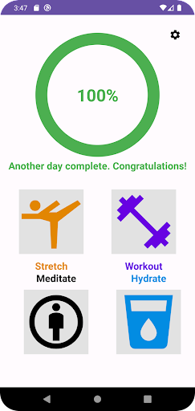
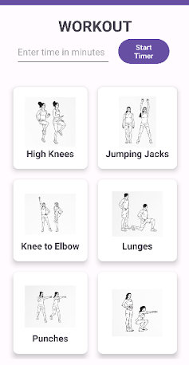
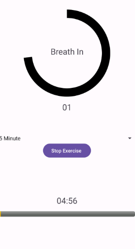
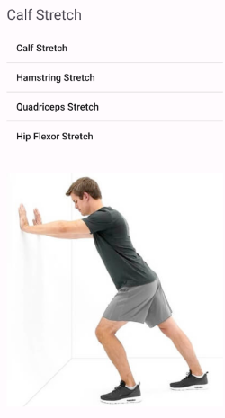
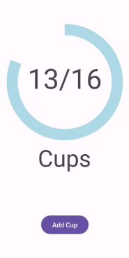

# helbred
*A fitness, health, and wellness app for Android.*

## Usage
### Installation and build
1. Clone the repo using `git clone`
2. Import the project using Android Studio 2022.2.1 Patch 2 or newer and Java 17.0.7 or newer
3. Perform a Gradle sync and resolve any version-mismatch issues
4. Build the app from the menu bar

### Use
Choose an activity to complete for the day. Use onscreen prompts to complete each category. complete 100% of your goals to finish the day.

## Project Structure:

    . README.md                                             # You are here
    . demo                                                  # contains images for this file
    . app               
    ├── src
    |   ├── main\java\com\team03\helbred\                   # Contains all app code
    |   └── main\res\layout                                 # Contains all app layouts
    └── 

## App Images

 

 

 

